# 🧪 Y.Mine Validation Hub · 决策系统验证中心

### 让 AI 决策「可审计、可熔断、可跨域迁移」—— 这里是对这句话的全部实验验证现场

**建议访问动线：Profile → index → 任意实验页 → PDF 看学术深度**

---

## ✨ 这是什么？

**Game-OS 决策引擎的可交互验证集群。**

不是 PPT 里的架构图，是每个模块都能**点开、能跑、能出数据**的活体实验。

五个实验不是并列罗列，而是**一条决策生命周期的四个阶段**。每个页面在 URL 上独立可分享，但在证据链上同属一条链路：

| 阶段 | 页面 | 验证对象 | 核心机制 |
| :--- | :--- | :--- | :--- |
| — | 🏠 **index** | 实验集群总控台 | 五大实验统一入口 + **全站证据链面板** |
| — | 🧪 **hub** | 总控台（旧书签兼容） | 重定向至 index，保留兼容旧链接 |
| — | 📖 **manual** | 产品说明 + 实验手册 + 术语表 | 飞书式树形导航，讲清「是什么/怎么用/术语含义」 |
| 👁 **状态感知** | ⚙️ **entropy-model** | 熵值模型 · 状态判定引擎 | 0.5/0.68 阈值 · 正态分布 · 1/e 参考线 · 收敛/发散态切换 |
| 🧪 **决策实验** | 📊 **ab-test** | A/B 实验评估台 | 确定性哈希分流 · 转化追踪 · 两比例 z-test + 贝叶斯 P(B>A) · 95% 置信区间 · 样本量规划 · 期望损失 |
| 📈 **收敛验证** | 📈 **oscillator** | 归一振荡模拟器 | 系统归一收敛行为的可视化验证 |
| 🧠 **记忆沉淀** | 🧠 **ms-lab** | MindSpeak 嵌入实验室 | 四级向量仓储 · AES-256-GCM 加密 · KMP 骨架检索 · RBAC 三级权限隔离 |
| 🧠 **记忆沉淀** | 🧠 **MemoryBase** | 公共底层记忆基座 | 五级仓储 · 三级权限 · 曲风/人格隔离（独立子目录入口） |

> 工程巧思：全站纯静态前端，但通过 `mock-api.js` 模拟真实后端异步交互（loading / 延迟 / 错误注入 / 状态追踪），零依赖跑出完整产品体验。

---

## 🏗️ 图 1：系统架构全景图

```mermaid
%%{init: {'theme': 'dark', 'themeVariables': {
  'background': '#0a080c',
  'primaryColor': '#A78BFA',
  'primaryBorderColor': '#A78BFA',
  'primaryTextColor': '#d4c0a8',
  'secondaryColor': '#1a1420',
  'tertiaryColor': '#0e0b10',
  'lineColor': '#3a2a30'
}}}%%
graph TB
    subgraph portal["🚪 入口层"]
        P1["🏠 index.html<br>实验集群总控台"]:::portal
        P2["📌 hub.html<br>旧书签兼容"]:::portal
        P3["👤 Profile<br>个人叙事主页"]:::portal
    end

    subgraph ab_test["📊 Y-Exp · 旗舰实验"]
        A1["📋 实验设计<br>样本量规划 · 预期收益"]:::ab1
        A2["🎲 分流引擎<br>确定性哈希 · 可复现分组"]:::ab2
        A3["📈 转化追踪<br>模拟点击 · 实时累积"]:::ab3
        A4["🧠 统计判定<br>z-test + P(B>A)"]:::ab4
    end

    subgraph experiments["🧪 其他实验模块"]
        E2["🧠 MindSpeak 嵌入实验室<br>四级向量 · AES-256-GCM"]:::exp2
        E3["⚙️ 熵值模型 · 状态判定<br>0.5/0.68 阈值 · 收敛/发散"]:::exp3
        E4["📈 归一振荡模拟器<br>系统归一收敛验证"]:::exp4
    end

    subgraph datalayer["💾 数据与资产层"]
        D1["localStorage<br>yexp_data 持久化"]:::data
        D2["mock-api.js<br>模拟后端异步交互"]:::data
        D3["📄 Fibonacci–染色体同构 PDF"]:::asset
        D4["🎨 Midnight Tavern UI 设计集"]:::asset
    end

    P1 --> ab_test
    P1 --> experiments
    ab_test --> D1 & D2
    experiments --> D1 & D2
    ab_test --> D3 & D4

    classDef portal fill:#2a1a3a,stroke:#A78BFA,stroke-width:2px,color:#d4c0a8;
    classDef ab1 fill:#1a1a3a,stroke:#818CF8,stroke-width:2px,color:#A5B4FC;
    classDef ab2 fill:#1a2a3a,stroke:#22D3EE,stroke-width:2px,color:#67E8F9;
    classDef ab3 fill:#2a1a2a,stroke:#F472B6,stroke-width:2px,color:#F9A8D4;
    classDef ab4 fill:#2a2a1a,stroke:#FBBF24,stroke-width:2px,color:#FCD34D;
    classDef exp2 fill:#1a2a2a,stroke:#34D399,stroke-width:2px,color:#6EE7B7;
    classDef exp3 fill:#2a1a2a,stroke:#F472B6,stroke-width:2px,color:#F9A8D4;
    classDef exp4 fill:#1a2a1a,stroke:#34D399,stroke-width:2px,color:#6EE7B7;
    classDef data fill:#1a1420,stroke:#818CF8,stroke-width:1.5px,color:#8ab0b8;
    classDef asset fill:#1a1420,stroke:#FBBF24,stroke-width:1.5px,color:#FCD34D;

    style portal fill:#0a080c,stroke:#A78BFA,stroke-width:1px
    style ab_test fill:#0a080c,stroke:#818CF8,stroke-width:2px
    style experiments fill:#0a080c,stroke:#22D3EE,stroke-width:1px
    style datalayer fill:#0a080c,stroke:#FBBF24,stroke-width:1px
```

---

## 📊 旗舰实验：Y-Exp · 实验评估框架

`ab-test.html`（926 行）是一套可在浏览器里完整跑通的 A/B 实验评估流水线：

- **分流**：确定性哈希分流，同一访客始终落入同一组，结果可复现
- **转化追踪**：支持模拟点击与批量注入，实时累积各组转化数据
- **统计判定**：两比例 z-test + 贝叶斯 P(B>A) 双轨判读，95% 置信区间
- **实验设计**：最小样本量估算（α=0.05, β=0.20 双侧）与预期收益估算
- **数据层**：localStorage（`yexp_data`）本地持久化 + MockAPI 模拟后端
- **默认实验**：内置「检索策略对比 v1.2」，打开页面即可动手跑完整流程

页面同时挂载本仓库两份深度 PDF，实验数据与学术/设计资产同场呈现。

---

### 🎯 图 2：AB 测试 · Y-Exp 实验评估框架（全景流程）

```mermaid
%%{init: {'theme': 'dark', 'themeVariables': {
  'background': '#0a080c',
  'primaryColor': '#818CF8',
  'primaryBorderColor': '#818CF8',
  'primaryTextColor': '#d4c0a8',
  'secondaryColor': '#1a1420',
  'tertiaryColor': '#0e0b10',
  'lineColor': '#3a2a30'
}}}%%
graph TB
    subgraph experiment_design["📐 实验设计层"]
        E1["📋 样本量规划<br>α=0.05 · β=0.20<br>双侧检验"]:::design
        E2["💰 预期收益估算<br>开跑前先算清代价"]:::design
        E3["🎯 默认实验<br>检索策略对比 v1.2"]:::design
    end

    subgraph traffic_allocation["🎲 分流层"]
        A1["🔀 确定性哈希分流<br>同一访客 → 同一组<br>结果可复现"]:::traffic
    end

    subgraph experiment_run["⚡ 实验运行层"]
        R1["📊 模拟点击注入"]:::run
        R2["📈 实时数据累积<br>各组转化追踪"]:::run
    end

    subgraph statistical_judgment["📊 统计判定层"]
        J1["📐 z-test<br>双轨判读"]:::judge
        J2["🧠 P(B>A) 后验概率<br>95% 置信区间"]:::judge
        J3["📊 效应量估算<br>显著性/实用性双判"]:::judge
    end

    subgraph persistence["💾 持久化层"]
        P1["localStorage<br>yexp_data"]:::persist
        P2["MockAPI<br>模拟后端异步"]:::persist
    end

    experiment_design --> traffic_allocation
    traffic_allocation --> experiment_run
    experiment_run --> statistical_judgment
    statistical_judgment --> persistence

    classDef design fill:#1a1a3a,stroke:#818CF8,stroke-width:2px,color:#A5B4FC;
    classDef traffic fill:#1a2a3a,stroke:#22D3EE,stroke-width:2px,color:#67E8F9;
    classDef run fill:#2a1a2a,stroke:#F472B6,stroke-width:2px,color:#F9A8D4;
    classDef judge fill:#2a2a1a,stroke:#FBBF24,stroke-width:2px,color:#FCD34D;
    classDef persist fill:#1a1420,stroke:#34D399,stroke-width:2px,color:#6EE7B7;

    style experiment_design fill:#0a080c,stroke:#818CF8,stroke-width:1px
    style traffic_allocation fill:#0a080c,stroke:#22D3EE,stroke-width:1px
    style experiment_run fill:#0a080c,stroke:#F472B6,stroke-width:1px
    style statistical_judgment fill:#0a080c,stroke:#FBBF24,stroke-width:1px
    style persistence fill:#0a080c,stroke:#34D399,stroke-width:1px
```

---

### 🎯 图 3：AB 测试 · 统计判定层详解

```mermaid
%%{init: {'theme': 'dark', 'themeVariables': {
  'background': '#0a080c',
  'primaryColor': '#FBBF24',
  'primaryBorderColor': '#FBBF24',
  'primaryTextColor': '#d4c0a8',
  'secondaryColor': '#1a1420',
  'tertiaryColor': '#0e0b10',
  'lineColor': '#3a2a30'
}}}%%
graph LR
    subgraph inference["🧠 统计推断层"]
        I1["z-test<br>显著性检验<br>p < 0.05"]:::inf
        I2["P(B>A) 后验概率<br>证据强度判读<br>> 95% 强证据"]:::inf
        I3["95% 置信区间<br>效应量范围<br>实用性与统计显著性双判"]:::inf
    end

    subgraph decision["🎯 决策层"]
        D1["✅ 实验有效<br>方案 A 胜出"]:::dec1
        D2["❌ 实验无效<br>无显著差异"]:::dec2
        D3["⚠️ 需继续<br>样本不足"]:::dec3
    end

    subgraph action["📋 行动层"]
        A1["🚀 全量上线<br>预期收益 X%"]:::action
        A2["🔄 迭代优化<br>新假设生成"]:::action
        A3["📊 扩展样本<br>继续运行"]:::action
    end

    I1 & I2 & I3 --> D1 & D2 & D3
    D1 --> A1
    D2 --> A2
    D3 --> A3

    classDef inf fill:#1a1a3a,stroke:#818CF8,stroke-width:2px,color:#A5B4FC;
    classDef dec1 fill:#1a2a1a,stroke:#34D399,stroke-width:2px,color:#6EE7B7;
    classDef dec2 fill:#2a1a1a,stroke:#F87171,stroke-width:2px,color:#FCA5A5;
    classDef dec3 fill:#2a2a1a,stroke:#FBBF24,stroke-width:2px,color:#FCD34D;
    classDef action fill:#1a1420,stroke:#A78BFA,stroke-width:2px,color:#d4c0a8;

    style inference fill:#0a080c,stroke:#818CF8,stroke-width:1px
    style decision fill:#0a080c,stroke:#34D399,stroke-width:1px
    style action fill:#0a080c,stroke:#A78BFA,stroke-width:1px
```

---

## 🔬 核心数据

| 指标 | 数据 |
| :--- | :--- |
| 🛡️ **幻觉率** | 从行业平均 15% 压至 **0.5%**（七层熔断 + 三模型冗余校验 + 11 条底层公理） |
| 🧪 **单元测试** | **148 项** 100% 通过 |
| 🔬 **跨域实验** | **41 个** · **25,424 次**实验运行 |
| 🚀 **引擎迁移** | 同一份引擎已迁移至 **扑克博弈（Poker Egg）** 与 **调酒消费（Y.Mine）** 两个极端场景 |

---

## 🧠 图 4：跨域验证证据

```mermaid
%%{init: {'theme': 'dark', 'themeVariables': {
  'background': '#0a080c',
  'primaryColor': '#A78BFA',
  'primaryBorderColor': '#A78BFA',
  'primaryTextColor': '#d4c0a8',
  'secondaryColor': '#1a1420',
  'tertiaryColor': '#0e0b10',
  'lineColor': '#3a2a30'
}}}%%
graph TB
    subgraph engine["⚙️ 统一决策引擎"]
        C["🔺 Game-OS 核心<br>决策锥体 · 0.68 阈值<br>七层熔断 · 三角审计"]:::core
    end

    subgraph domains["🌐 跨域迁移验证"]
        D1["♠️ 扑克博弈<br>Poker Egg<br>人格化 AI 对手"]:::domain1
        D2["🍸 调酒消费<br>Y.Mine<br>六维人格向量"]:::domain2
        D3["🧪 验证中心<br>Validation Hub<br>📊 AB 测试 · 🧠 MindSpeak"]:::domain3
    end

    subgraph evidence["📋 验证结论"]
        E1["✅ 同一套方法论<br>在 3 个极端场景下<br><b>全部成立</b>"]:::evidence
        E2["📊 AB 测试验证<br>z-test + 贝叶斯 P(B>A)<br>确定性哈希分流 · 可复现"]:::evidence
    end

    C --> D1 & D2 & D3
    D1 & D2 & D3 --> E1
    D3 --> E2

    classDef core fill:#1a1a2a,stroke:#FBBF24,stroke-width:3px,color:#FCD34D;
    classDef domain1 fill:#1a1a3a,stroke:#818CF8,stroke-width:2px,color:#A5B4FC;
    classDef domain2 fill:#2a1a2a,stroke:#F472B6,stroke-width:2px,color:#F9A8D4;
    classDef domain3 fill:#1a2a3a,stroke:#22D3EE,stroke-width:2px,color:#67E8F9;
    classDef evidence fill:#1a1a2a,stroke:#A78BFA,stroke-width:2px,color:#d4c0a8;

    style engine fill:#0a080c,stroke:#FBBF24,stroke-width:1px
    style domains fill:#0a080c,stroke:#A78BFA,stroke-width:1px
    style evidence fill:#0a080c,stroke:#22D3EE,stroke-width:1px
```

---

## 📂 结构说明

- `index.html` 现为 **「Y.Mine · 实验集群总控台」** 着陆页
- `hub.html` 保留同内容以兼容旧书签
- 个人叙事主页已抽离至独立仓库 **Profile**（Pages：`hellomind-star.github.io/Profile` 已上线）

---

## 📄 深度资产

| 资产 | 说明 |
| :--- | :--- |
| 📄 **Fibonacci-Chromosome Isomorphism** | 斐波那契数列与染色体结构的同构映射研究（黄金比例 φ、黄金角 137.5°、基因表达/端粒/带型同构），Game-OS 跨域同构方法论的学术底座 |
| 🎨 **Midnight Tavern · UI Portfolio** | MIDNIGHT TAVERN 全产品 UI 设计集（18 页 / 14 章）：世界观叙事、设计语言、游戏大厅、MBTI 调酒台、牌桌对决、人格护照、数据观测台等完整界面体系 |

---

## 🔗 关联仓库

| 仓库 | 定位 |
| :--- | :--- |
| **Profile** | 个人叙事主页：财务 → 工程 → MBA，一套决策操作系统的由来（独立 Pages 部署） |
| **poker-egg-fullstack** | 决策引擎 × 扑克博弈：人格化 AI 对手 + Kelly 真胜率面板（前端 + Railway 后端） |
| **personality-wine-mixing** | 决策引擎 × 调酒消费：六维人格向量统一契约，46 个纯函数引擎，637 测试用例 |
| **ymine-validation-hub**（本仓库） | 决策引擎的实验验证与方法论沉淀 |

---

## 🧭 Y.Mine 生态矩阵

同一套决策方法论驱动的在线站点集群（均 GitHub Pages 部署）：

| 站点 | 入口 |
| :--- | :--- |
| **Y.Mine 主站** | `hellomind-star.github.io/ymine` |
| **Dimension-Chess** | `hellomind-star.github.io/Dimension-Chess` |
| **Dimemsion-Chess-Latent** | `hellomind-star.github.io/Dimemsion-Chess-Latent` |
| **short-drama-mbti** | `hellomind-star.github.io/short-drama-mbti` |
| **agent-studio-board** | `hellomind-star.github.io/agent-studio-board` |
| **ymine-demos** | `hellomind-star.github.io/ymine-demos` |

---

## 🛠️ 技术说明

- **纯静态站点**（原生 HTML/CSS/JS），无构建步骤，GitHub Pages 直接部署
- **本地预览**：`python3 -m http.server 8000` 后访问 `http://localhost:8000`

### 共享模块（`src/`）

跨页面复用的代码统一放在 `src/`，各页面通过相对路径引用：

| 模块 | 作用 | 引用页面 |
| :--- | :--- | :--- |
| `theme.css` | **设计令牌单一来源**：13 个配色变量 + 3 个决策阈值（稳态 0.50 / 盈亏 0.48 / 熔断 0.68）。改主题只需动这一个文件 | 全部 7 个页面 |
| `starfield.js` | 星空背景画布引擎，自动接管尺寸变化与动画循环 | 4 个页面 |
| `trace.js` | **统一证据链总线**：跨实验审计记录，见下方专节 | 全部 6 个页面 |
| `stats.js` | **统计内核**：两比例 z-test、贝叶斯 P(B>A)、样本量、功效分析 | ab-test |
| `shell.js` | 工作台外壳：顶部四阶段导航条 + 全站命名登记表 | 全部页面 |
| `viz.js` | 手写 SVG 图表引擎（转化率对比 / 后验分布 / 时间轴 / 阶段流转） | 总控台 |
| `llm.js` | 可选 AI 解释层（BYOK，默认关闭，只解释不计算） | ab-test |

> 重构前，13 个 CSS 变量在 7 个 HTML 里各写一遍（98 处重复定义），`draw()`/`resize()` 星空逻辑逐字重复 5 遍。现已收敛为单一来源。

### 🔗 统一证据链（Trace）

「可审计」是这个仓库的核心主张，但重构前它实际上是空的：

| 页面 | 重构前 |
| :--- | :--- |
| ab-test | 仅此一页有记录，且 `logAction` 是 `el.textContent = ...` —— **只留最后一条，前面的被覆盖** |
| entropy-model | `addLog` 只写 DOM，**刷新即蒸发** |
| MemoryBase | `log()` 只写 DOM，同样不落盘 |
| ms-lab / oscillator | **完全没有日志** |

现在所有实验页共用 `src/trace.js` 这一条总线：

- **写入**：`YTrace.log({ action, detail, verdict, level })`，阶段与来源由 URL 自动推断
- **持久化**：`localStorage['ytrace_v1']`，环形缓冲上限 500 条，超出丢弃最旧
- **聚合**：总控台面板可按四阶段筛选，显示记录数 / 跨度 / 带结论数
- **导出**：一键导出 CSV（带 BOM，Excel 打开不乱码）
- **降级**：localStorage 不可用或配额超限时自动退化为内存存储，**绝不抛错阻断业务**

四个阶段对应的语义判断即天然结论：熵值模型的「收敛/发散」、A/B 的「通过/异常」、ms-lab 的「已拦截」，都会作为 `verdict` 沉淀下来——这是「可熔断」在证据链上的落点。

### 已知不一致

- `oscillator.html` 是全站**唯一**依赖外部 CDN 的页面（Chart.js + Font Awesome）。其余页面均为零依赖纯静态，离线可完整运行。若要统一到「零依赖」定位，需将该页图表改为手写 SVG 渲染。

---

## 👤 作者

**罗煜 · 决策系统架构 · 全栈产品孵化**

---

  🧪 可审计 · 可熔断 · 可跨域迁移
   
  「 让 AI 决策从黑盒变成可验证的实验现场 」

